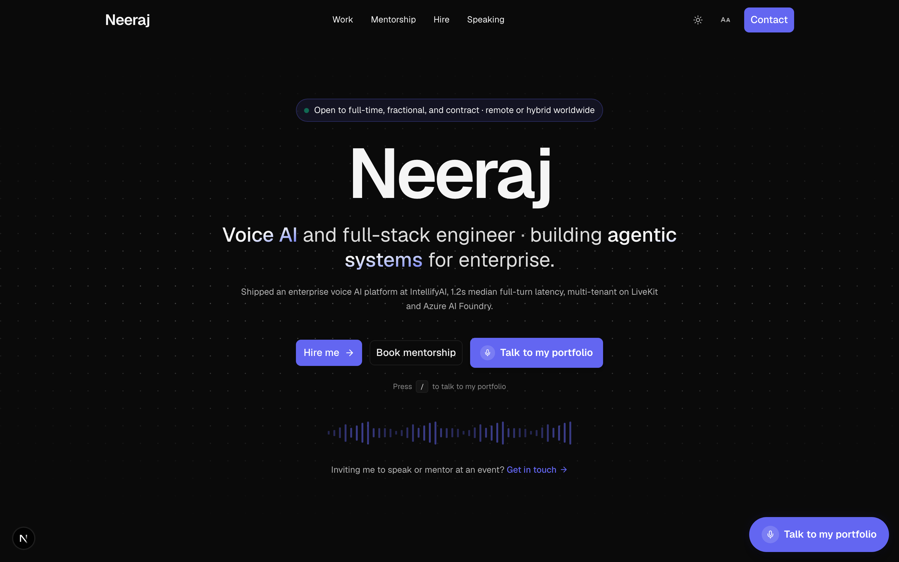
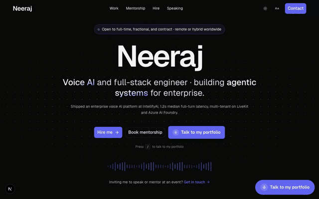
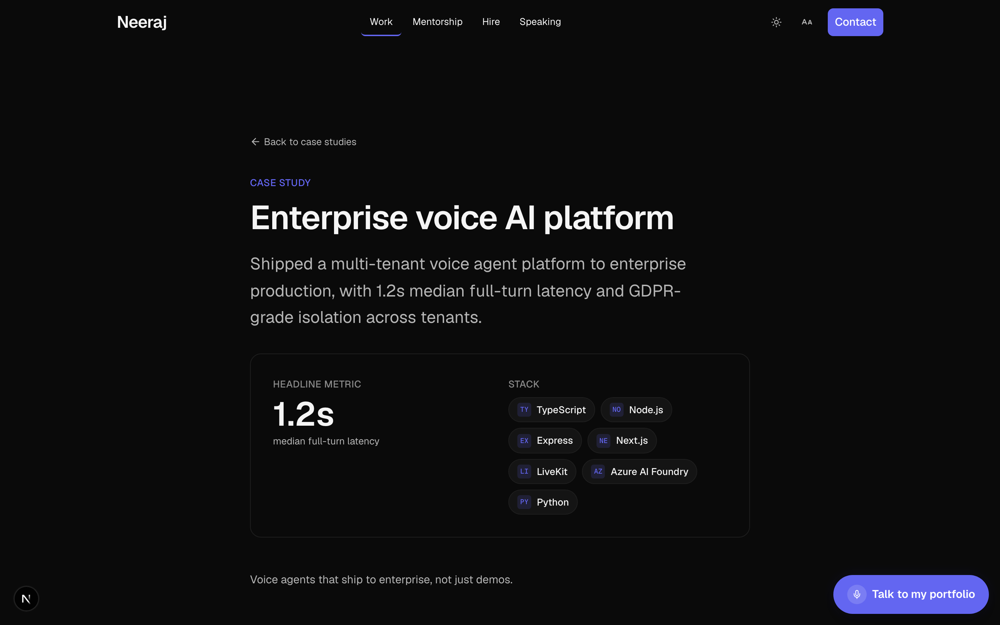
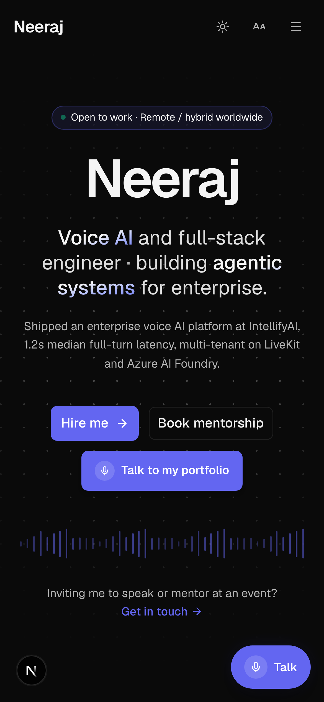
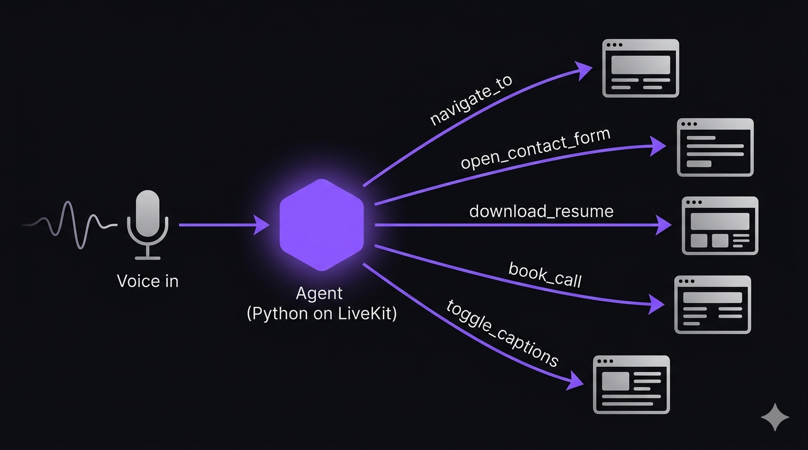

<div align="center">

# 🎙️ AI Voice Portfolio

### A portfolio that talks back.

An open-source AI engineering portfolio that is **itself a voice agent**. Visitors click "Talk to my portfolio" and a real-time voice agent gives them a guided, spoken tour: it narrates while scrolling and highlighting the page, answers questions, captures leads, and books calls inline.

<br/>

[](LICENSE)
[](CONTRIBUTING.md)
[](https://github.com/Neeraj-2311/ai-voice-portfolio/stargazers)
[](https://github.com/Neeraj-2311/ai-voice-portfolio/network/members)

<br/>

[](https://nextjs.org/)
[](https://react.dev/)
[](https://www.typescriptlang.org/)
[](https://tailwindcss.com/)
[](https://www.python.org/)
[](https://livekit.io/)
[](https://openai.com/)
[](https://deepgram.com/)

<br/>

**[🌐 Live Demo](https://hineeraj.com)** &nbsp;·&nbsp; **[🐛 Report Bug](https://github.com/Neeraj-2311/ai-voice-portfolio/issues)** &nbsp;·&nbsp; **[✨ Request Feature](https://github.com/Neeraj-2311/ai-voice-portfolio/issues)**

<br/>



</div>

<br/>

## 📋 Table of Contents

- [Overview](#-overview)
- [Demo](#-demo)
- [Features](#-features)
- [How it works](#%EF%B8%8F-how-it-works)
- [Tech stack](#%EF%B8%8F-tech-stack)
- [Quickstart](#-quickstart)
- [Configuration](#%EF%B8%8F-configuration)
- [Project structure](#-project-structure)
- [Deployment](#%EF%B8%8F-deployment)
- [Documentation](#-documentation)
- [Contributing](#-contributing)
- [License](#-license)
- [Use it for your own portfolio](#-use-it-for-your-own-portfolio)
- [Acknowledgements](#-acknowledgements)
- [Author](#-author)

<br/>

## 🧭 Overview

Most portfolios are static pages. This one is a conversation.

The repo combines the two halves of the product:

| Directory | What it is |
|-----------|-----------|
| [`web/`](web/) | The **Next.js site** (the portfolio itself plus the in-browser voice UI). |
| [`voice-agent/`](voice-agent/) | The **Python LiveKit Agents worker** that powers the conversation and all of its side effects (booking, email, lead capture). |

The browser and the agent meet inside a [LiveKit](https://livekit.io/) room. The browser mints a short-lived token, the agent is dispatched into the room, and the agent drives the UI over RPC while the user simply talks.

<br/>

## 🎬 Demo

> **Try the live version:** **[hineeraj.com](https://hineeraj.com)** — click **"Talk to my portfolio"** and start talking.

<div align="center">
  
</div>

<br/>

<table>
  <tr>
    <td valign="top"></td>
    <td valign="top" align="center" width="270"></td>
  </tr>
  <tr>
    <td align="center"><sub>📄 MDX case-study deep-dives</sub></td>
    <td align="center"><sub>📱 Fully responsive</sub></td>
  </tr>
</table>

<br/>

## ✨ Features

- 🎙️ **Talk to the site.** A real-time voice agent gives a guided, spoken tour of the work.
- 📜 **The page follows the voice.** As the agent speaks, the page auto-scrolls to and highlights whatever it names, with zero latency (driven from the transcript, no tool calls).
- 📅 **Books real calls.** Live Cal.com v2 availability and booking, completed inside the conversation.
- 📨 **Captures leads.** Voice-driven contact form fill, lead-capture email (Resend), and a Google Sheets fallback record, all handled on the agent backend.
- ⌨️ **Graceful fallbacks.** Text mode when the mic is blocked, captions, and a non-voice contact form.
- 🌓 **Polished frontend.** Dark/light theme (no flash), restrained motion, MDX case studies, full SEO (sitemap, robots, JSON-LD, OG images).
- 🔒 **Safe by design.** Server-only secrets, allowlisted RPC ids/paths, and short-lived room tokens.
- 🧩 **Single source of truth.** The agent's knowledge is generated from the same content the site renders, so the two never drift.

<br/>

## 🏗️ How it works

<div align="center">

</div>

```
Visitor ──▶ web/ (Next.js)  ──POST /api/voice/token──▶ mint LiveKit token + dispatch agent
   │  tap "Talk to my portfolio"                              │
   │                                                          ▼
   └────────── join LiveKit room (wss) ──────────▶  voice-agent/ (Python on LiveKit)
                                                       STT ▸ LLM ▸ TTS
                       UI ◀── RPC (scroll, highlight, open forms, cards) ──┘
                       side effects ─▶ Cal.com booking · Resend email · Google Sheets
```

The agent narrates from a knowledge base generated out of the site's own content: `web/scripts/build-voice-kb.ts` reads `web/src/content/*` and emits `voice-agent/src/portfolio_kb.json`. See **[docs/architecture.md](docs/architecture.md)** for the full flow and the agent ▸ frontend RPC contract.

<br/>

## 🛠️ Tech stack

**Frontend** — Next.js 16 (App Router), React 19, TypeScript, Tailwind CSS v4, Framer Motion, MDX, `@livekit/components-react`, Cal.com embed, Resend.

**Voice agent** — Python, [LiveKit Agents](https://github.com/livekit/agents), `uv`. A Deepgram (STT) ▸ OpenAI (LLM) pipeline with a **pluggable TTS** (OpenAI, Cartesia, or open-weight Kokoro, switched via `TTS_BACKEND`) on your own provider keys, with ai-coustics noise cancellation, Silero VAD, an English turn detector, an idle-timeout auto hang-up, and Cal.com v2 / Resend / Google Sheets integrations.

**Infra** — Netlify (site), LiveKit Cloud (agent worker), Docker.

<br/>

## 🚀 Quickstart

You run two processes: the **site** and the **agent worker**. Each has its own environment file. You will need a free [LiveKit Cloud](https://cloud.livekit.io/) project plus an [OpenAI](https://platform.openai.com/) and [Deepgram](https://deepgram.com/) key.

### 1. Clone

```bash
git clone https://github.com/Neeraj-2311/ai-voice-portfolio.git
cd ai-voice-portfolio
```

### 2. Web (Next.js)

```bash
cd web
npm install
cp .env.example .env.local      # fill in the values you have
npm run dev                     # ▸ http://localhost:3000
```

### 3. Voice agent (Python, uv)

```bash
cd voice-agent
uv sync
cp .env.example .env.local      # LIVEKIT_*, OpenAI/Deepgram keys, tool keys
uv run python src/agent.py download-files   # one-time: VAD + turn-detector models
uv run python src/agent.py dev              # connects to your LiveKit project
```

With both running, open the site, click **Talk to my portfolio**, and the agent joins the room. After editing site content, regenerate the agent's knowledge base:

```bash
cd web && npm run build:voice-kb            # writes voice-agent/src/portfolio_kb.json
```

<br/>

## ⚙️ Configuration

Nothing real is committed. Both apps ship a `.env.example` and ignore every real `.env*` file.

<details>
<summary><b>Web environment variables</b></summary>

| Variable | Purpose |
|----------|---------|
| `NEXT_PUBLIC_SITE_URL` | Public site URL (metadata, OG, sitemap). |
| `NEXT_PUBLIC_SITE_EMAIL` | Public contact email shown across the site. |
| `LIVEKIT_API_KEY` / `LIVEKIT_API_SECRET` / `LIVEKIT_URL` | Server keys to mint room tokens in `/api/voice/token`. |
| `NEXT_PUBLIC_LIVEKIT_URL` | `wss://` endpoint the browser connects to. |
| `NEXT_PUBLIC_CAL_USERNAME` | Cal.com username for booking links. |
| `RESEND_API_KEY` / `RESEND_FROM` / `RESEND_TO` | Contact-form fallback email. |
| `NEXT_PUBLIC_PLAUSIBLE_DOMAIN` | Optional analytics; unset disables it. |

See [`web/.env.example`](web/.env.example) for the annotated list.
</details>

<details>
<summary><b>Voice-agent environment variables</b></summary>

Required at minimum: `LIVEKIT_URL`, `LIVEKIT_API_KEY`, `LIVEKIT_API_SECRET`, plus your STT/LLM keys (Deepgram, OpenAI) and tool keys (Cal.com, Resend, Google Sheets).

**TTS is pluggable** via `TTS_BACKEND` — pick a provider and set its key, no code change:

| `TTS_BACKEND` | Provider | Needs |
|---|---|---|
| `openai` *(default)* | OpenAI `gpt-4o-mini-tts` | `OPENAI_API_KEY` (already set) |
| `cartesia` | Cartesia Sonic (streaming + cloning) | `CARTESIA_API_KEY` |
| `kokoro` | Kokoro-82M (open weights, CPU, free) | `uv sync --extra kokoro` |
| `cerebrium` | self-hosted XTTS clone | `CEREBRIUM_*` |

See [`voice-agent/.env.example`](voice-agent/.env.example) for the full annotated list.
</details>

<br/>

## 📦 Project structure

```
ai-voice-portfolio/
├── web/             Next.js site + browser voice UI   → docs/web.md
│   ├── src/app/         App Router routes + /api/voice/token
│   ├── src/components/  voice arc, sections, booking, contact
│   ├── src/content/     structured content (single source of truth)
│   └── scripts/         build-voice-kb.ts (generates the agent KB)
├── voice-agent/     Python LiveKit Agents worker       → docs/voice-agent.md
│   ├── src/             agent.py (entrypoint), root_agent.py, tools, KB
│   └── tests/           pytest suite
├── docs/            architecture + per-app guides
├── CONTRIBUTING.md
└── LICENSE
```

<br/>

## ☁️ Deployment

| Target | Where | Notes |
|--------|-------|-------|
| **Site** | [Netlify](https://www.netlify.com/) | Set the project **Base directory** to `web` (the app is not at the repo root). Netlify then reads `web/netlify.toml`. |
| **Agent** | [LiveKit Cloud](https://cloud.livekit.io/) | Ships a `Dockerfile` and `livekit.toml`. Deploy from `voice-agent/` with `lk agent deploy`, or run the image on any Docker host. |

<br/>

## 📚 Documentation

| Doc | What's inside |
|-----|---------------|
| [docs/architecture.md](docs/architecture.md) | End-to-end flow, token + dispatch, the agent ▸ frontend RPC contract, where side effects run. |
| [docs/web.md](docs/web.md) | The Next.js app: stack, structure, env, run, deploy. |
| [docs/voice-agent.md](docs/voice-agent.md) | The Python worker: pipeline, tools, env, run, tests, deploy. |

<br/>

## 🤝 Contributing

Contributions, issues, and feature requests are welcome. This is a real project, not a museum piece, so PRs that fix bugs or sharpen the experience are appreciated.

1. **Fork** the repo and create your branch: `git checkout -b feature/amazing-thing`
2. Make your change. Keep the web app `npm run lint` / `npm run typecheck` clean and the agent's `uv run pytest` green.
3. **Commit**: `git commit -m "Add amazing thing"`
4. **Push**: `git push origin feature/amazing-thing`
5. Open a **Pull Request**.

See **[CONTRIBUTING.md](CONTRIBUTING.md)** for the full guide (dev setup, conventions, and what CI checks).

### ⭐ Show your support

If this project helped or inspired you, **give it a star** and share it. Forks and stars are what tell me it is worth maintaining in the open.

<br/>

## 📄 License

Distributed under the **MIT License**. See [`LICENSE`](LICENSE) for the full text.

| You can | You must |
|---------|----------|
| ✅ Use it commercially | 📄 Include the original license and copyright notice |
| ✅ Modify it | |
| ✅ Distribute it | |
| ✅ Use it privately | |

<br/>

## 🧑‍🎨 Use it for your own portfolio

You are welcome to build your own portfolio on top of this. To make it yours:

1. Replace the content in `web/src/content/*` (bio, projects, experience, skills, socials) and the images in `web/public/`.
2. Swap the favicon (`web/src/app/icon.png`) and footer avatar (`web/public/user.jpg`).
3. Run `npm run build:voice-kb` so the agent learns your content.
4. Point the env vars at your own LiveKit / OpenAI / Deepgram / Cal.com accounts.

The MIT license does not require it, but if you ship something based on this, a **link back to this repo or to [hineeraj.com](https://hineeraj.com) is genuinely appreciated**, and I'd love to see what you build, tag me.

<br/>

## 🙏 Acknowledgements

- The voice-agent half started from the excellent [LiveKit Agents Python starter](https://github.com/livekit-examples/agent-starter-python) (also MIT).
- Built with [LiveKit](https://livekit.io/), [Next.js](https://nextjs.org/), [OpenAI](https://openai.com/), and [Deepgram](https://deepgram.com/).

<br/>

## 👤 Author

<table>
  <tr>
    <td>
      
    </td>
    <td>
      <b>Neeraj</b><br/>
      Full-stack AI engineer. Production voice agents and the systems behind them.<br/>
      Delhi, India · Remote / hybrid worldwide
    </td>
  </tr>
</table>

[](https://hineeraj.com)
[](https://www.linkedin.com/in/neeraj-ai-guy/)
[](https://x.com/NeerajGoesAi)
[](mailto:neeraj.aideveloper@gmail.com)

<br/>

<div align="center">

If you got this far, the agent would love to give you the tour. **[Talk to it →](https://hineeraj.com)**

⭐ **Star this repo** if you found it useful.

</div>
